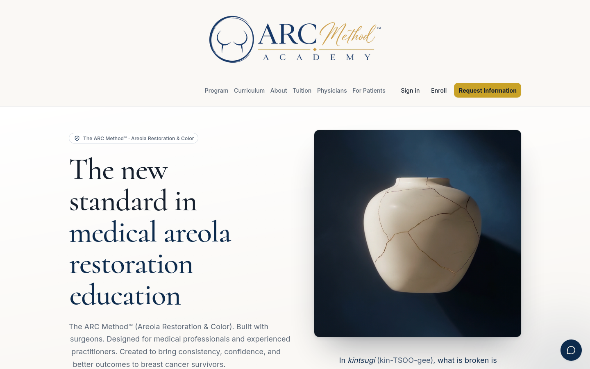
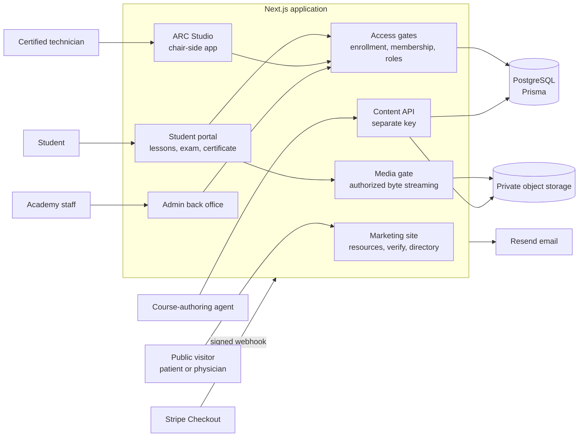
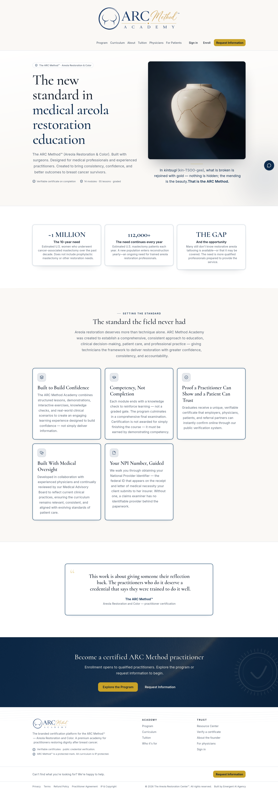
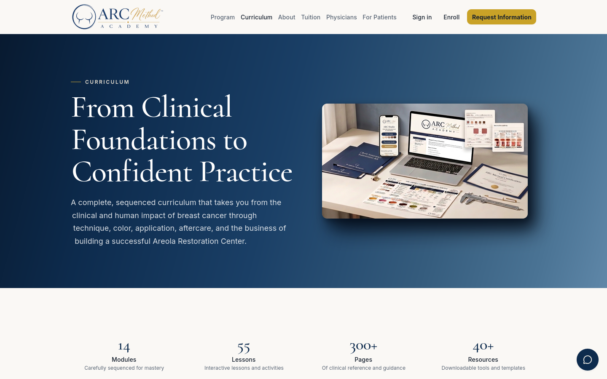
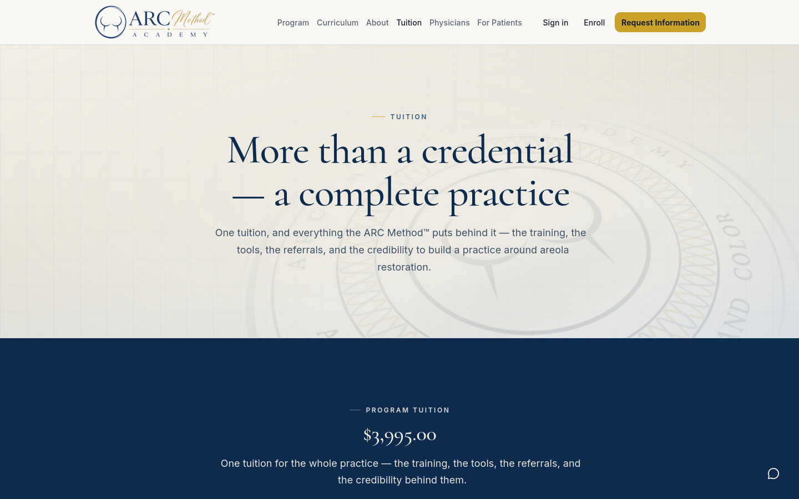

# ARC Method Academy

**A branded, IP-protected certification academy for areola restoration: gated video curriculum, a tamper-resistant final assessment, and certificates anyone can verify.**

Live: [arcmethodacademy.com](https://arcmethodacademy.com)

---

## What it is

ARC Method Academy is the online certification program of The Areola Restoration Center. It trains licensed and aspiring practitioners in the ARC Method, a paramedical tattoo technique that restores the appearance of the areola after mastectomy and breast reconstruction.

The platform handles the whole path a practitioner takes: paying tuition, signing the practitioner agreement, working through a sequenced 14-module curriculum of video, audio and written lessons, passing a final assessment, and receiving a numbered certificate that a surgeon or patient can check on the public site. Behind it sits a full back office, so the academy runs its own courses, students, certificates, coupons, inquiries and team without a developer.

## Highlights

- **Course content that never leaves the gate.** Lesson video, audio, images and downloads live in private object storage. The browser never receives a storage address or a shareable signed link: every byte request goes back through the app, which checks the session and an active, unexpired enrollment before streaming it. Range requests are supported, so video seeks instantly without the file ever being exposed.
- **A final assessment built to be fair and hard to game.** The exam opens only after every lesson is complete and needs 85% to pass. Answer keys never reach the browser, grading happens on the server, a failed attempt shows only which questions were missed, and retakes wait 24 hours. The engine can also give each learner their own form, a stratified draw from the 200-plus question pool with per-module quotas and shuffled answer order, saved so a refresh serves the same sitting; the academy sets the draw size per course.
- **Certificates with a public, privacy-safe verification page.** Passing issues one certificate per learner, numbered `ARC-YYYY-NNNNNN`, rendered as a vector PDF with a guilloché border. Anyone can enter the number at `/verify` and see the holder's name, course, issue date and status, and nothing else. Revoking a certificate takes it off the public record immediately.
- **An electronically signed practitioner agreement.** Before teaching content opens, the student signs the academy's agreement with an emailed one-time code. The exact document text is stored with a SHA-256 integrity record, so the academy can later show precisely what each person agreed to and when.
- **Payments that cannot be faked.** Stripe Checkout prices are computed on the server. Paid enrollments are created only by a signature-verified Stripe webhook, so a replayed or forged event produces nothing, and a retried delivery never creates a duplicate. Accounts are provisioned server-side; there is no public sign-up.
- **Full admin control with scoped staff roles.** A command center with enrollment, completion and revenue metrics; student records, manual enrollment, deactivation and password resets; certificate issue, revoke and restore; coupons; an inquiries inbox with replies; and a team page where the owner grants staff access area by area.
- **More than a course.** The same app runs a free public directory of verified breast-cancer support resources by state and nationally, a public "find a certified technician" directory, physician partnership and patient-referral forms, an AI site assistant, and ARC Studio, an installable chair-side app for certified technicians.

## The brief and the outcome

**What the academy needed.** The Areola Restoration Center wanted to teach its method to practitioners across the country without giving the method away. The requirements specification called for a branded academy with enrollment and payment, a 14-module video curriculum, quizzes and a final assessment, verifiable certificates, protection for the course material, and an admin side the academy could run on its own.

**What Emergent delivered.** A single Next.js application covering the marketing site, the student portal, the admin back office and the public verification page, live at the academy's own domain. The curriculum was loaded through a dedicated, authenticated content API that Emergent's course-authoring agent uses, with every change snapshotted so it can be rolled back in one call. Ungraded knowledge checks run inside lessons, and certification rests on the final assessment plus a current bloodborne-pathogens certificate that staff review.

**What it changed.** The academy sells, delivers and certifies without manual steps: a Stripe payment becomes an account, an enrollment and a welcome email; finishing every lesson opens the exam; passing it issues the certificate and puts the holder on the public record. Along the way the platform grew into a patient- and physician-facing site, with a resource directory, a technician directory and referral forms, that the academy can edit itself through an approval-gated page builder.

## Architecture

Everything is one Next.js application with four audiences, each in its own route group with its own guard: the public site, the signed-in student portal, ARC Studio for certified technicians, and the admin back office. A fifth lane, the content API, takes a separate key and is used only by the course-authoring agent. All access decisions go through a small set of shared predicates (an active enrollment, a current membership, a role or staff scope), and every protected API route checks its lane's guard before doing any work. Course media sits in private storage and is only ever streamed through the media gate. Stripe talks to the app through a signed webhook, which is the only way a paid enrollment comes into existence.

The full walk-through is in [docs/architecture.md](docs/architecture.md).

## Engineering notes

**Answer keys are kept out by construction, not by filtering.** Learner-facing reads of quizzes and the exam select only the question fields a student may see; they never load a key and strip it afterwards. The admin answer review, which does need keys, uses a separate admin-only function, and a static test checks that it never shares code with the student-side readers. Tests assert the absence of key fields both at the data layer and in the raw HTTP responses, including on failed attempts. The exam sampler itself is given only key-free question rows, so the draw and the answer shuffle cannot depend on where the correct answer is.

**A missing guard fails the tests.** The app has 165 API route files across several trust lanes (public, student, admin, technician, content agent). Rather than rely on review to catch a forgotten check, coverage tests walk the route files of the sensitive lanes (admin, ARC Studio, the content API, messaging, practice review and community) straight off disk and assert that each one uses the right guard for its lane, and that the agent guard is never used anywhere else. Because the routes are discovered rather than listed, a new admin route without an area permission check fails the suite automatically.

**Verification that reveals nothing it shouldn't.** The public verify lookup goes through one serializer that returns a fixed set of public fields and never touches the holder's email or account. A revoked certificate, a hidden one and a number that never existed all return the same response with the same status code, so the page cannot be used to probe which numbers are real. Downloads of the certificate PDF are limited to its owner; a certificate emailed to a graduate opens through a signed, expiring link scoped to that one certificate.

**Certification "earned" versus "current".** Tuition includes a year of portal access and active membership. When membership lapses, the portal, the member resource shelves, the technician directory listing and ARC Studio close, but the earned certificate, its PDF and its public verification record stay permanent. That rule lives in one predicate that takes membership as a required input, so any new feature that depends on "certified" has to say where that fact comes from rather than defaulting to yes.

**Content that an AI agent can load without being trusted with everything.** Curriculum is authored outside the app and loaded through its own API: the agent reads a manifest of structure and content hashes (never lesson bodies or answer keys by default), and every update snapshots the previous course first so it can be rolled back. Large audio and video go straight to storage through short-lived upload links that the platform issues for a key it chooses; the platform then re-hashes the uploaded file and refuses it if the bytes do not match what the agent claimed.

## Tech stack

| Layer | Technology |
|---|---|
| App | Next.js 16 (App Router), React 19, TypeScript |
| Styling | Tailwind CSS 4 with a themeable design-token system |
| Data | PostgreSQL via Prisma 7 |
| Auth | Better Auth (email and password, magic links; public sign-up disabled) |
| Payments | Stripe Checkout, promotion codes, signed webhooks |
| Email | Resend |
| Storage | S3-compatible private object storage, presigned direct uploads |
| Documents | `@react-pdf/renderer` for certificates and session cards |
| Editing | Tiptap rich-text editor with server-side HTML sanitizing |
| Admin UI | TanStack Table, Recharts |
| Validation | Zod 4 at every API boundary |
| AI | LLM site assistant with tool calling and streamed replies |
| Testing | Vitest |
| Hosting | [HostKit](https://github.com/codeslayer44/hostkit-showcase), Emergent's in-house hosting platform |

## By the numbers

| | |
|---|---|
| Commits | 861 (2026-06-25 to 2026-10-05) |
| Source lines | 263,272 |
| Tracked files | 1,629 |
| Test files | 327 |
| Test cases | about 4,970 (`it`/`test` calls counted across the suite) |
| API route files | 165 |
| Pages | 90 |
| Data models | 66 |
| SQL migration scripts | 46 (additive SQL scripts, counted by hand) |
| Languages | TypeScript 96.8%, JavaScript 1.3% |

## Screenshots

**Home page (full length)**

**Curriculum overview**

**Tuition and payment**

## About this repo

ARC Method Academy's source code is private and owned by the client. This repository documents what was built and how it works, and contains no source code from the product.

Built by [Emergent AI Agency](https://emergentaiagency.com) (Ryan Chappell) for The Areola Restoration Center. If you need a course, certification or membership platform where the content has to stay protected and the credential has to stand up to scrutiny, get in touch through [emergentaiagency.com](https://emergentaiagency.com).
