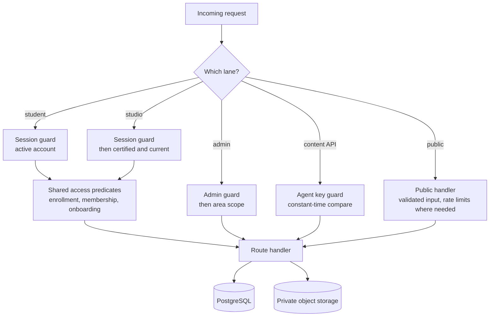
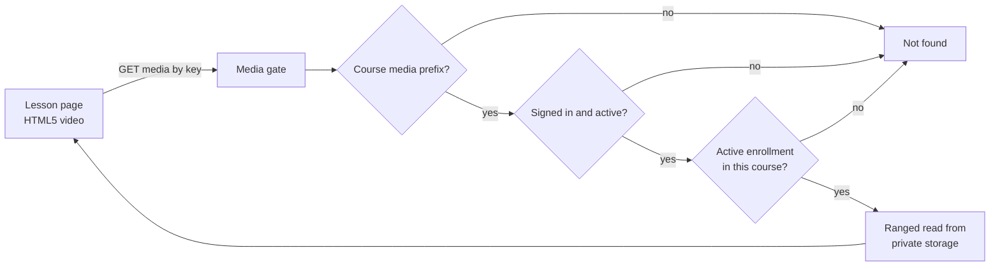
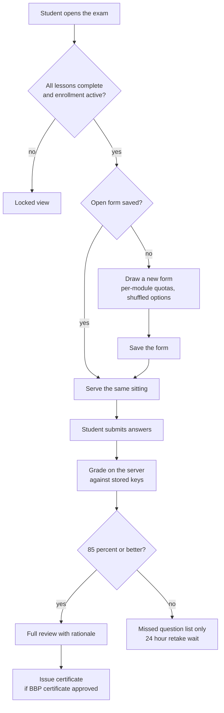
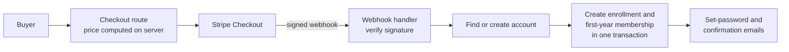

# ARC Method Academy: architecture

This is a deeper walk-through of how the platform is put together. It describes design and behaviour, not code; the source is private.

## One application, five lanes

The academy is a single Next.js 16 application (App Router, React 19, TypeScript) backed by PostgreSQL through Prisma. Rather than splitting into services, it separates audiences by route group, each with its own layout guard and its own API guard:

| Lane | Who | What it covers |
|---|---|---|
| Public | Anyone | Marketing pages, tuition and enrollment, the resource directory, the technician directory, physician and patient forms, certificate verification, the site assistant |
| Student portal | Enrolled students and graduates | Dashboard, lessons, the final assessment, certificates, member resource shelves, messages to the instructor, account |
| ARC Studio | Certified technicians with current membership | An installable chair-side app: pigment kit, colour matching, measurement and session records |
| Admin | Academy staff, by scope | Courses, students, enrollments, assessments, certificates, coupons, inquiries, pages, resources, settings, team |
| Content API | The course-authoring agent | Loading and updating the curriculum, media uploads, rollback |

Page layouts redirect people who do not belong, but the authoritative check is always in the API route. Each protected route checks its lane's guard before doing any work, and for the sensitive lanes (admin, ARC Studio, the content API, messaging, practice review and community) coverage tests walk the route files on disk to make sure that stays true.

## Access model

A handful of small, pure predicates answer every "may this person see this?" question, and every gate in the app calls them instead of re-deriving the rule:

- **Active enrollment.** An enrollment is active when its status is active and its paid-through date has not passed. Staff with an admin or staff role can preview everything; a deactivated account is refused everywhere, and its sessions are cleared when it is deactivated.
- **Onboarding.** A new enrollment opens the welcome module only after the practitioner agreement is signed, and the teaching modules after the orientation call is booked.
- **Sequence.** Lessons unlock in course order. A lesson is complete only when the student marks it complete, and where a lesson has an intro audio clip or an uploaded lesson video, the student must have gone through it first. The final assessment opens when every lesson is complete.
- **Certified and current.** Being a certified technician means holding an issued, unrevoked certificate and a current membership. This one predicate decides access to ARC Studio, the public technician directory listing and the certified badge.

Denials on student-facing resources return a plain "not found", so the response never confirms that something exists.

## Protecting the course material

The academy's method is its business, so course material is treated as private by default.

- **No public objects.** Lesson video, intro audio, images and downloadable resources are stored under private keys. The client is given only an app-relative media address; it never sees a storage URL or a long-lived signed link it could share.
- **Every byte is re-authorized.** The media gate first restricts the request to course media (certificates and other private areas are blocked outright), then checks the session, then the enrollment for the course the key belongs to. Video is served with HTTP range support straight from storage, so seeking is fast and nothing is buffered whole.
- **Downloads carry the academy's notice.** Downloadable resources are served one at a time by id, only if the resource is marked downloadable and the student has course access, with a copyright notice and no-store caching.
- **Uploads are cleaned on the way in.** Images are re-encoded and stripped of metadata. Uploads are checked against a type allowlist and size cap before anything is written.
- **The agreement comes first.** Before teaching content opens, the student signs the practitioner agreement electronically. A six-digit code sent to the account's email confirms the signer; the agreement text as shown, the legal name, the time and the version are stored together with SHA-256 hashes of both the document and the signing evidence. Staff can later print the record and see whether its integrity check still passes.

## The final assessment

- **Keys stay on the server.** The student-side exam read selects only the prompt and options. The submit route validates the body and discards anything else a client might send, such as a score or a pass flag. Pass or fail is computed from an exact ratio, not a rounded percentage.
- **Per-learner forms.** When the academy sets a draw size for the course, each student gets a stratified draw across modules, with the answer order shuffled per question. The form is saved before it is served, re-served unchanged on refresh, and consumed on submit. Each recorded attempt keeps a snapshot of exactly what was shown, so a study sheet can be rebuilt from it later.
- **Reveal policy.** A pass shows the full answer review. A fail shows only which questions were missed, so retakes test understanding rather than memory of the key.
- **Operator preview.** Staff can take the exam to check it; their attempts are graded the same way but never recorded and never issue a certificate.
- **Bloodborne-pathogens prerequisite.** The academy requires a current BBP certificate from an outside provider before it issues its own. Students upload theirs, staff approve it, and the certificate pipeline checks for an approved, unexpired one. The rule is provider-agnostic on purpose, because which BBP course is acceptable depends on where the practitioner works. A student who passes before approval receives the certificate automatically once it is approved.

## Certificates and verification

- **Issued once, numbered safely.** The issuing step is idempotent per student and course, so every later passing attempt returns the existing certificate. Numbers follow `ARC-YYYY-NNNNNN`; concurrent issues cannot collide, because a uniqueness constraint guards the number and a clash simply retries.
- **No record without a document.** The PDF is rendered and stored before the certificate row is created. If the file ever goes missing, the download route regenerates it.
- **A vector certificate.** The PDF is drawn entirely in vectors: the academy's typography, a generated guilloché border and rosettes, the holder's name, number and date, and the address of the verification page.
- **Owner-only download.** The PDF is served only to its owner, through one route, never as a storage link. The emailed certificate link carries a signed, expiring token valid for that single certificate, so a graduate can open it without signing in.
- **Public verification.** `/verify` accepts a certificate number and returns the holder's name, course, issue date and status. One serializer is the only path to that data, and it never selects contact details or account identifiers. Unknown, hidden and revoked numbers all receive the same response, and input length is capped before any database read.
- **Revocation.** Staff can revoke or restore a certificate from the admin; revoking removes it from public verification and from everything gated on "certified".

## Enrollment and payment

- The checkout route takes a course and an optional coupon, never a price. It refuses a signed-in buyer who is already enrolled and attaches trusted metadata for the webhook.
- The webhook is the only place a paid enrollment is created. A missing or invalid signature is rejected with no side effects. A delivery that fails mid-way returns an error so Stripe retries it, and a replayed delivery is recognized and does nothing, so a paid enrollment is never lost or doubled. Refunds flip the enrollment's status.
- New buyers get an account created on the server and a set-password email. Public self-service sign-up is switched off.
- Tuition includes a year of portal access and the first year of membership, written in the same transaction so a new graduate is never shown as "not current" on the day they paid. An earned certificate stays valid and verifiable even when membership lapses.

## Admin and staff permissions

The back office is a command center with date-ranged metrics (enrollments, completions, certificates, revenue) and pages for courses, students, enrollments, assessments, certificates, coupons, inquiries, resources, marketing pages, appearance, email and team. Staff accounts hold per-area permissions (courses, learners, inquiries, financials, site configuration, resources, pages), and the owner holds all of them. Navigation is filtered by permission, and revenue figures are left out of the page entirely for staff who lack the financial scope. Guards prevent an admin from locking themselves out or removing the last owner.

Course content is edited in a structured editor (modules, lessons with rich text, images, video, resources, practice questions, exam questions) or bulk-imported as a whole course document. Every save runs in one database transaction, and lesson HTML is sanitized on the server. A course with enrollments or certificates cannot be deleted.

## Content API and the authoring agent

The curriculum is written outside the app and loaded by Emergent's course-authoring agent through a dedicated API lane:

- The lane has its own key, compared in constant time, and is locked when no key is configured. No other lane accepts that key.
- Reads start from a manifest of structure, content hashes and media references. Lesson bodies and question keys are returned only on explicit request, one lesson at a time.
- Each update saves a snapshot of the whole course first, so any change, including a rollback, can be undone.
- Large media goes straight to storage. The agent asks for an upload, the platform chooses the storage key and returns a short-lived upload link with the content type locked in, and on commit the platform checks the size and re-hashes the full file against the hash the agent declared. A mismatch is refused.

Marketing pages use the same idea: pages are stored as block documents with brand-locked visuals, drafts are previewed exactly as visitors will see them, and publishing requires a recorded human approval of that exact draft version. Data-driven sections such as the curriculum outline, the verification lookup and the state directory are fixed blocks an edit cannot remove.

## Beyond the course

- **Resource directory.** A free, no-login directory of verified breast-cancer support resources, by state and nationally, with categories, cost tiers, a "last checked" date on every listing and a public "report a problem" form. Listings are imported unpublished and published by staff.
- **Find a technician.** A public directory of practitioners who are certified and current.
- **Physicians and patients.** A physician partnership form with qualifying questions, a physician patient-referral form, and patient guidance requests, all landing in the staff inquiries inbox.
- **Site assistant.** An LLM assistant on the public pages that answers from a curated, human-editable knowledge base, can look up a certificate through the same public verification path, and can hand a conversation to staff only after the visitor explicitly confirms. It is rate-limited per visitor and was tested with an adversarial prompt suite.
- **ARC Studio.** An installable, mobile-first app for certified technicians, with their pigment kit, a guided colour-matching path that builds formulas only from bottles they own, a size calculator and a session record with a branded PDF.

## Testing

The suite is Vitest: 327 test files and about 4,970 test cases. Beyond unit tests of the pure libraries (access predicates, exam sampling, grading, certificate numbering, PDF rendering, sanitizing), it includes route-level tests for the security boundaries (answer keys absent from responses, forged webhooks rejected, replays idempotent, non-owners getting "not found") and the guard-coverage tests that fail the suite when a route is missing its guard. Database changes ship as additive SQL migration scripts, 46 so far.

## Hosting

The app runs on [HostKit](https://github.com/codeslayer44/hostkit-showcase), Emergent's in-house hosting platform, as a standalone Next.js build with PostgreSQL, S3-compatible object storage, scheduled backups and health-checked deploys. Production is served from the academy's own domain, [arcmethodacademy.com](https://arcmethodacademy.com).
